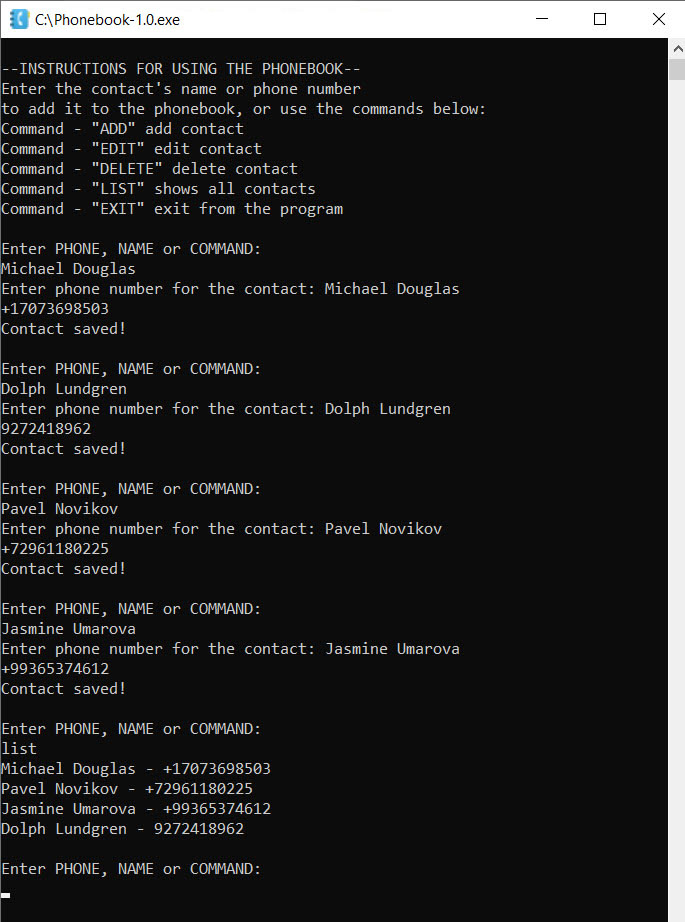

## phonebook

### This program simulates a phonebook using the terminal of the operating system

***Description:***

This JAVA code example demonstrates how to work with strings and regular expressions 
and track down ways to incorrectly enter data to avoid errors and bugs in the program.

***How to use:***

Create the "Main" class run configuration in your IDE and start the program.
To add a contact to the phone book, you can use the command "add" 
after which you will be prompted to enter the contact name first 
and then the phone number. You can also add a contact simply by entering 
a phone number into the terminal, after which the program will offer 
to add a name to the phone and vice versa. Please note that if you enter a name 
and a phone number in a row, this addition will not work. It is impossible to enter a set of numbers 
as a telephone since the register is set to the generally accepted telephone format. 
It is also impossible to enter a string containing symbols and numbers as a name.

***Tools used:***

Java  
Maven  

